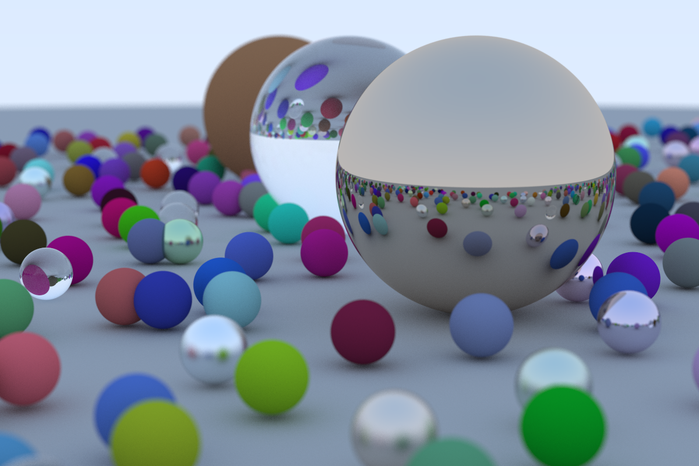

# A Ray Tracing Engine
## How to run this engine
```
git clone https://github.com/mxmlkzdh/RayTracing.git
cd RayTracing
mkdir build
cd build
cmake ..
cmake --build .
./main
```
## The Immediate Roadmap
- [x] Add support for positioning and orienting the camera
- [x] Add support for Lambertian surfaces
- [x] Add support for metals
- [ ] Add support for dielectrics
- [ ] Memory optimizations
- [ ] Parallel computing to speed up the rendering phase
- [ ] GPU rendering
- [ ] Add support for solid textures
- [ ] Add support for light sources


